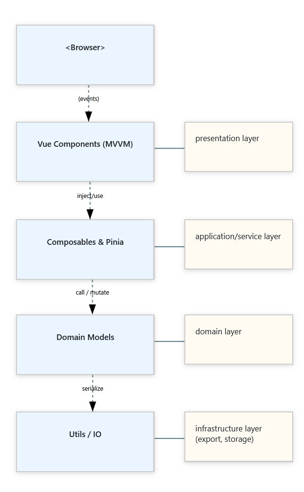

# UML Class Diagram Editor

Lehký, browser-native editor pro kreslení UML třídních diagramů.

## Cíl projektu 🎯

Vytvořit jednoduchý nástroj na diagramy, který běží v každém moderním prohlížeči, ale přitom nabízí všechny klíčové
funkce, které power-users potřebují k modelování, úpravám a sdílení UML třídních diagramů.

## Hlavní funkce

| Akce                            | Co uživatel může dělat                                                                                 |
|---------------------------------|--------------------------------------------------------------------------------------------------------|
| **Vkládání & rozmístění prvků** | Drag-and-drop tříd, enumerací a poznámek z palety na plátno; snap-guides okamžitě pomáhají s rovnáním. |
| **Propojování**                 | Kreslení asociací, dědičnosti, agregace aj. – s živými ohyby čar a koncovými značkami.                 |
| **Úpravy v kontextu**           | Boční panel umožňuje měnit názvy, atributy, metody, viditelnost i anotace.                             |
| **Time-travel editing**         | Vícekrokové undo/redo.                                                                                 |
| **Rychlá práce**                | Známé klávesové zkratky (Ctrl + Z/Y, S atd.).                                                          |
| **Ulož & sdílej**               | Export diagramů do SVG, PNG, JPG nebo JSON; JSON lze znovu naimportovat a pokračovat v práci.          |

## Architektura

| Vrstva             | Složky / soubory   | Technologie & vzory                                  |
|--------------------|--------------------|------------------------------------------------------|
| **Styly**          | `assets/scss/**`   | SCSS 7-1 architektura + BEM                          |
| **UI**             | `components/*.vue` | Vue 3 SFC, Composition API, feature-first rozvržení  |
| **Sdílená logika** | `composables/*.js` | `use*` hooky pro drag, snap, kameru…                 |
| **Doména**         | `models/*.js`      | Čisté ES6 třídy (Entity, Relationship, …)            |
| **Stav**           | `stores/*.js`      | Pinia - single source of truth                       |
| **Utils**          | `utils/*.js`       | `HistoryManager` (undo/redo), debounce, math helpers |

## Diagram vrstev (High-Level)

