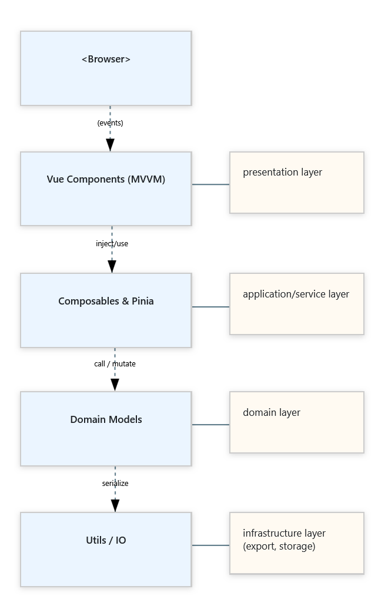

# UML Class Diagram Editor

Light-weight, browser-native editor for drawing UML class diagrams.

## Project Goal 🎯

Create a simple diagramming tool that runs in any modern browser yet keeps the core power users need to
model, edit, and share UML class diagrams.

## Core Features

| Action                       | What the user can do                                                                                    |
|------------------------------|---------------------------------------------------------------------------------------------------------|
| **Place & arrange elements** | Drag classes, enums, and notes from the palette onto a canvas; snap-guides help tidy layouts instantly. |
| **Connect things**           | Draw associations, inheritance, aggregation, and more—with live bend-points and end-markers.            |
| **Edit in context**          | Side-panel forms let you tweak names, attributes, methods, visibility, and annotations.                 |
| **Time-travel editing**      | Multistep undo/redo.                                                                                    |
| **Work at speed**            | Familiar shortcuts (Ctrl + Z/Y, S, etc.).                                                               |
| **Save & share**             | Export diagrams as SVG, PNG, JPG, or JSON; later re-import JSON to continue later.                      |

## Architecture

| Layer            | Key Folders / Files | Tech & Patterns                                          |
|------------------|---------------------|----------------------------------------------------------|
| **Styling**      | `assets/scss/**`    | SCSS 7-1 architecture + BEM                              |
| **UI**           | `components/*.vue`  | Vue 3 SFCs, Composition API, feature-first folder layout |
| **Shared Logic** | `composables/*.js`  | `use*` hooks for drag, snap, camera…                     |
| **Domain**       | `models/*.js`       | Plain ES6 classes (Entity, Relationship, …)              |
| **State**        | `stores/*.js`       | Pinia - single source of truth                           |
| **Utils**        | `utils/*.js`        | `HistoryManager` (undo/redo), debounce, math helpers     |

## Layer Diagram (High-Level)

